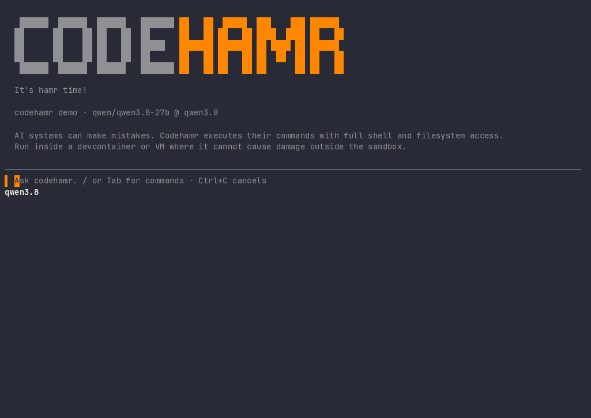

# codehamr

A small, standalone coding agent for the terminal, released under the MIT license.
Connect a local model server or an API provider of your choice. No project account
or subscription is required.



The agent works through four tools: `bash`, `read_file`, `write_file`, and
`edit_file`. It reads your project, makes changes, runs checks, and replies when
finished. There are two slash commands, one embedded system prompt, and one
configuration file.

## Install

On Linux or macOS:

```bash
curl -fsSL https://raw.githubusercontent.com/codehamr/codehamr/main/install.sh | bash
```

On Windows:

```cmd
curl -fsSL https://raw.githubusercontent.com/codehamr/codehamr/main/install.cmd -o install.cmd && install.cmd
```

Both installers download binaries from the project's GitHub releases. Run
`codehamr` in your project directory.

The `bash` tool requires `/bin/sh`. On Windows, run codehamr inside WSL2 or a
Linux devcontainer so shell commands can execute.

The agent executes shell commands with your user's permissions. Use a
devcontainer or a virtual machine when you need isolation. codehamr itself does
not provide a sandbox.

## Configuration

The first launch creates `.codehamr/config.yaml` with one `local` profile.
Existing profiles belong to you. Startup does not add missing default profiles.

```yaml
active: local
models:
    local:
        llm: qwen3.8:27b
        url: http://localhost:11434
        key: ""
        context_size: 262144
    openrouter:
        llm: anthropic/claude-opus-5.5
        url: https://openrouter.ai/api/v1
        key: ${OPENROUTER_API_KEY}
        context_size: 1000000
```

Each profile specifies a model ID, API base URL, optional API key, and context
window. A key written as `${VARIABLE_NAME}` is read from the environment when the
client is created. Saving the configuration preserves that reference. Literal
keys are also supported. Keep `.codehamr/` out of version control.

Set `context_size` to the window your backend actually serves. Missing or
nonpositive values default to `262144`. The client reserves space for the system
prompt, tool schemas, and response, then packs recent conversation history into
the remaining space. Token counts are estimates.

For Ollama, match `context_size` to `OLLAMA_CONTEXT_LENGTH` or the Modelfile
`num_ctx` setting. Lower the client value if the server serves a smaller window.
When Ollama runs on the host and codehamr runs in a devcontainer, use
`http://host.docker.internal:11434` if your container exposes that host address.

The system prompt is compiled from `internal/config/PROMPT_SYS.md`. Editing it
requires rebuilding the binary. Give project instructions in the conversation.

## OpenRouter

Add the `openrouter` profile above and provide your key:

```bash
export OPENROUTER_API_KEY='your API key'
codehamr
```

Then enter `/models openrouter`. The example uses `anthropic/claude-opus-5.5`; you can
replace it with another model that supports function tools and the Responses
API. Adjust `context_size` to the chosen model and provider.

OpenRouter receives requests at `https://openrouter.ai/api/v1/responses`.
The client preserves the `/api/v1` prefix, streams responses, and sends tool
results back through the same API. See the
[OpenRouter Responses documentation](https://openrouter.ai/docs/api/api-reference/responses/create-responses).
Provider usage is billed through your own account.

## Other model servers

codehamr uses the Responses API with streaming and function tools. A server root
such as `http://localhost:11434` becomes `/v1/responses`. A base that already ends
in `/v1` gets only `/responses` appended. Custom path prefixes are preserved.

A successful `/v1/models` check proves connectivity, not Responses support.
Servers exposing only `/v1/chat/completions` need a Responses adapter or an
upgrade. If a model prints tool calls as text, check the server's tool parser
and chat template.

Profiles with a key send a small inference request at startup and activation to
check the model and credentials. This can incur a small provider charge.
Profiles without a key only check connectivity to the models endpoint.

## Commands and keys

* `/models` lists the configured profiles.
* `/models <name>` selects and saves a profile. Tab cycles through completions.
* `/clear` resets the conversation and saved prompt history.
* Enter submits a prompt. Alt+Enter inserts a newline.
* Ctrl+C cancels the current turn. Press it again to quit.
* Ctrl+D quits when the prompt is empty.
* Ctrl+L clears the prompt and redraws the screen while keeping the conversation.
* Up and Down recall earlier prompts when the cursor reaches the input boundary.

Configuration is reloaded when you use slash commands. A prompt submitted while
the agent is busy is queued for the next turn.

## Runtime and privacy

Give the agent the toolchains needed to build and run your project. The embedded
prompt asks it to verify changes and report checks it cannot run as `unverified`.
Verification depends on the model following those instructions.

Prompts are saved in `.codehamr/history`. Optional `logging: true` records prompts,
responses, and tool activity in `.codehamr/log.txt`, replacing the previous log
on startup. These files can contain sensitive project data. API requests go to
the endpoint you configure.

Release binaries check GitHub for updates at startup. Set
`CODEHAMR_NO_UPDATE_CHECK=1` to disable this. Local development builds skip the
update check.

Other environment settings:

* `CODEHAMR_URL` overrides the active profile URL without saving it.
* `CODEHAMR_IDLE_TIMEOUT` sets the initial stream inactivity timeout as a Go
  duration such as `90m`, or as a number of seconds. The default is one hour.
  After response data arrives, the timeout is at most five minutes. Keepalive
  lines reset the timer.

## Development

Use Go 1.26, as specified in `go.mod` and CI.

```bash
go test ./...
go test -race ./...
go vet ./...
go run ./cmd/codehamr --help
```

`make build` produces binaries for Linux, macOS, and Windows on amd64 and arm64.
`make run` builds and runs the host binary. `make install` installs into
`$(PREFIX)/bin`, with `/usr/local` as the default prefix.

`make demo` renders the README animation from compact terminal frames in
`media/`. `make demo-record` records a new Qwen session with the current UI.
See the [demo instructions](media/README.md) for requirements and source files.

The optional OpenRouter integration test sends real requests using the
`openrouter` profile in a local project. It checks activation, a structured tool
call, and a streamed answer after replaying the tool result:

```bash
CODEHAMR_TEST_OPENROUTER_PROJECT="$PWD" go test ./internal/llm -run '^TestOpenRouterIntegration$' -count=1 -v
```

The regular test suite skips this test unless the variable is set. Never commit
an API key.

## License

[MIT](LICENSE).
